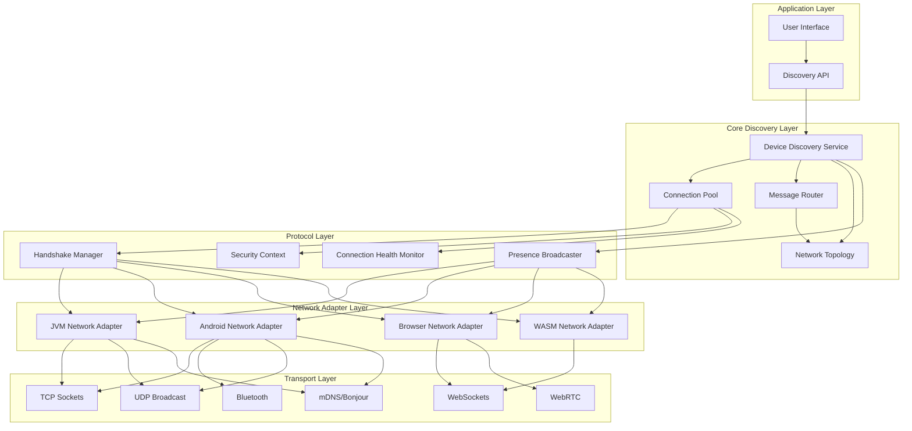

# Design Document: Enhanced Device Discovery

## Overview

The Enhanced Device Discovery system builds upon the existing Omnisyncra device discovery capabilities to provide robust, secure, and efficient peer-to-peer communication across multiple platforms. The system uses a layered architecture with platform-specific network adapters, intelligent routing, and advanced connection management.

The design emphasizes reliability through redundant discovery protocols, security through end-to-end encryption, and performance through efficient serialization and connection pooling. The system supports JVM Desktop, Android, JavaScript Browser, and WebAssembly platforms with optimized networking for each environment.

## Architecture

### High-Level Architecture



### Component Responsibilities

**Device Discovery Service**: Central orchestrator that coordinates discovery protocols, manages device lifecycle, and provides unified API to applications.

**Connection Pool**: Manages active peer connections with automatic reconnection, health monitoring, and resource cleanup.

**Message Router**: Handles message delivery with intelligent routing, path optimization, and failure recovery.

**Network Topology**: Maintains graph representation of network structure and provides routing intelligence.

**Presence Broadcaster**: Announces device availability and capabilities across all supported protocols.

**Handshake Manager**: Handles connection establishment, authentication, and protocol negotiation.

**Security Context**: Manages encryption, authentication, and trust relationships between peers.

**Connection Health Monitor**: Continuously monitors connection quality and triggers optimization.

## Components and Interfaces

### Core Interfaces

```kotlin
interface EnhancedDeviceDiscovery {
    val discoveredDevices: StateFlow<List<NetworkDevice>>
    val connectedDevices: StateFlow<List<NetworkDevice>>
    val networkTopology: StateFlow<NetworkTopology>
    val connectionHealth: StateFlow<Map<String, ConnectionHealth>>
    
    suspend fun startDiscovery(protocols: Set<DiscoveryProtocol>): Result<Unit>
    suspend fun stopDiscovery(): Result<Unit>
    suspend fun connectToDevice(deviceId: String, options: ConnectionOptions): Result<PeerConnection>
    suspend fun disconnectFromDevice(deviceId: String): Result<Unit>
    suspend fun sendMessage(deviceId: String, message: P2PMessage): Result<Unit>
    suspend fun broadcastMessage(message: P2PMessage, filter: DeviceFilter?): Result<Unit>
    fun observeMessages(): Flow<ReceivedMessage>
}

interface NetworkAdapter {
    val supportedProtocols: Set<DiscoveryProtocol>
    val platformCapabilities: PlatformCapabilities
    
    suspend fun startDiscovery(protocol: DiscoveryProtocol): Result<Unit>
    suspend fun stopDiscovery(protocol: DiscoveryProtocol): Result<Unit>
    suspend fun establishConnection(device: NetworkDevice, options: ConnectionOptions): Result<PlatformConnection>
    suspend fun sendData(connection: PlatformConnection, data: ByteArray): Result<Unit>
    fun observeIncomingConnections(): Flow<IncomingConnection>
    fun observeDiscoveredDevices(): Flow<List<NetworkDevice>>
}

interface MessageRouter {
    suspend fun routeMessage(targetDeviceId: String, message: P2PMessage): Result<Unit>
    suspend fun findRoute(targetDeviceId: String): Result<List<String>>
    fun updateTopology(topology: NetworkTopology)
    fun observeRoutingEvents(): Flow<RoutingEvent>
}

interface SecurityContext {
    suspend fun authenticateDevice(deviceId: String, challenge: ByteArray): Result<AuthenticationResult>
    suspend fun encryptMessage(message: P2PMessage, deviceId: String): Result<EncryptedMessage>
    suspend fun decryptMessage(encrypted: EncryptedMessage, deviceId: String): Result<P2PMessage>
    suspend fun rotateKeys(deviceId: String): Result<Unit>
    fun getTrustLevel(deviceId: String): TrustLevel
}
```

### Platform-Specific Adapters

**JVM Network Adapter**:
- Primary: TCP sockets for reliable peer connections
- Secondary: UDP broadcast for local discovery
- Tertiary: mDNS/Bonjour for service discovery
- Features: High bandwidth, server capabilities, full networking stack

**Android Network Adapter**:
- Primary: TCP sockets for internet connectivity
- Secondary: Bluetooth for local device connections
- Tertiary: UDP broadcast for local network discovery
- Features: Battery optimization, mobile network awareness, sensor integration

**Browser Network Adapter**:
- Primary: WebSocket for server connections
- Secondary: WebRTC for peer-to-peer connections
- Features: CORS compliance, browser security model, DOM integration

**WASM Network Adapter**:
- Primary: WebSocket with optimized serialization
- Features: High-performance computing, memory efficiency, near-native speed

## Data Models

### Enhanced Network Device Model

```kotlin
@Serializable
data class NetworkDevice(
    val id: String,
    val name: String,
    val type: DeviceType,
    val platformInfo: PlatformInfo,
    val capabilities: DeviceCapabilities,
    val networkInfo: NetworkInfo,
    val securityInfo: SecurityInfo,
    val presenceInfo: PresenceInfo,
    val metadata: Map<String, String> = emptyMap()
)

@Serializable
data class PlatformInfo(
    val platform: Platform,
    val version: String,
    val architecture: String,
    val supportedProtocols: Set<DiscoveryProtocol>
)

@Serializable
data class NetworkInfo(
    val addresses: List<NetworkAddress>,
    val preferredAddress: NetworkAddress,
    val bandwidth: Long, // bytes per second
    val latency: Long, // milliseconds
    val reliability: Float // 0.0 to 1.0
)

@Serializable
data class SecurityInfo(
    val publicKey: ByteArray,
    val certificateChain: List<ByteArray>,
    val trustLevel: TrustLevel,
    val lastAuthenticated: Long
)

@Serializable
data class PresenceInfo(
    val status: PresenceStatus,
    val lastSeen: Long,
    val batteryLevel: Float?,
    val currentLoad: Float,
    val availableForTasks: Boolean
)
```

### Message Protocol

```kotlin
@Serializable
sealed class P2PMessage {
    abstract val messageId: String
    abstract val timestamp: Long
    abstract val senderId: String
    abstract val targetId: String?
}

@Serializable
data class DataMessage(
    override val messageId: String,
    override val timestamp: Long,
    override val senderId: String,
    override val targetId: String?,
    val payload: ByteArray,
    val contentType: String,
    val priority: MessagePriority = MessagePriority.NORMAL
) : P2PMessage()

@Serializable
data class ControlMessage(
    override val messageId: String,
    override val timestamp: Long,
    override val senderId: String,
    override val targetId: String?,
    val command: ControlCommand,
    val parameters: Map<String, String> = emptyMap()
) : P2PMessage()

@Serializable
data class PresenceMessage(
    override val messageId: String,
    override val timestamp: Long,
    override val senderId: String,
    override val targetId: String? = null,
    val presenceInfo: PresenceInfo,
    val deviceCapabilities: DeviceCapabilities
) : P2PMessage()
```

### Network Topology Model

```kotlin
@Serializable
data class NetworkTopology(
    val nodes: Map<String, TopologyNode>,
    val edges: List<TopologyEdge>,
    val metrics: TopologyMetrics,
    val lastUpdated: Long
)

@Serializable
data class TopologyNode(
    val deviceId: String,
    val connections: Set<String>,
    val centrality: Float,
    val isBridge: Boolean,
    val clusterCoefficient: Float
)

@Serializable
data class TopologyEdge(
    val sourceId: String,
    val targetId: String,
    val weight: Float, // based on latency and reliability
    val protocol: DiscoveryProtocol,
    val establishedAt: Long
)

@Serializable
data class TopologyMetrics(
    val diameter: Int,
    val averagePathLength: Float,
    val clusteringCoefficient: Float,
    val connectedComponents: Int,
    val bridgeNodes: Set<String>
)
```

## Correctness Properties

*A property is a characteristic or behavior that should hold true across all valid executions of a system-essentially, a formal statement about what the system should do. Properties serve as the bridge between human-readable specifications and machine-verifiable correctness guarantees.*

After analyzing es:

### Discovery Protocol Propertiesrty 1: Multi-protocol **s 10.6ementquirRe: dates**Valinditions
network coand rror type d based on e be provideould shggestionsecovery su, rconditiony* error For anions**
*suggestecovery xt-aware r Conteerty 51:**

**Proprements 10.5s: Requi*Validate
*lyeful gracegradety should dnctionaliaustion, furce exhstem resouny* sy**
*For anghandliexhaustion e  resourculy 50: Gracefropert0.4**

**Pements 1: Requir
**Validatesresfailug inent cascad should prevtternseaker pa br, circuitiocenar slurefaiy* anion**
*For ntailure preveaker fircuit breoperty 49: C**

**Prrements 10.3s: Requiidate
**Val applicationded to thed be provis shoulessager mul erroningfmeant failure,  establishmeection any* conn
*Fors**rror messageMeaningful eerty 48: **Prop

 10.2**quirementss: Re
**Validate occurould sh protocolsifferentretry with dic , automaty failureny* discovere**
*For ay failuron discoverocol retry : Prot*Property 47

*1**ts 10.iremenRequdates: ng
**Valiggibuged for dehould be logation sror inform detailed ererror,rk etwoFor any* ng**
* loggind errorailerty 46: Det
**Properties
Proper Handling # Erro##s 9.6**

Requirementtes: ty
**Validaricuing for sefore process occur ben shouldioatalid schema vtion,rializasessage dey* mey**
*For anecuritalidation sa vy 45: SchemPropert**

**rements 9.5: Requilidatesd
**Vaned be maintaibility shoulrd compati backwaevolution,* schema *
*For anympatibility*evolution coma chey 44: Spert

**Prots 9.4**remenuiates: Reqd
**Validould be usempression shco, delta  conditionsidthd bandwnder limitesmission ua tran dat* repeated
*For anyidth**ited bandwion for lim compress3: Deltay 4
**Propertnts 9.3**
Requiremelidates: *Vaplied
*uld be apion shop compressgzi 1KB, er thanessage largFor any* m*
*ld*ion threshoCompresserty 42: op
**Pr9.2**
s rementtes: RequiidaValted
**be supporion should atalizng serimitreaon, szatict serialige objey* lar**
*For anectsr large objon foserializatiing Streamperty 41: ro

**P*1*nts 9.: Requiremealidates
**Vtionializa sernaryt bien for efficied be usrs shoulduffe Protocol Balization,e seriessagy* m ane**
*Fors usagtocol Bufferrty 40: ProProperties

** Propezation### Seriali*

6*nts 8.equiremees: Ridatreams
**Valable stobservded through  be provi shouldics metre qualityl-timitoring, reaalth monction heny* conneng**
*For a streamiime metricseal-tperty 39: RPro

**5**nts 8.s: RequiremedateVali**ested
ould be suggs shn methodconnectioe tivity, alternaor qual poction withy* conne
*For anons**od suggestiive methternatty 38: AlProper

**4**rements 8.dates: Requi*Valid
*reported and etecteshould be don, it itind coionk congestworr any* netion**
*Foetectstion dy 37: Congeert

**Propments 8.3** Require*Validates:
* analysisendtrd for maintaineshould be  history on, qualityconnecti any* 
*Fornance** maintetoryy hisaliterty 36: Qu**Prop*

8.2*rements s: Requi*Validatetriggered
*n should be timizatiolds, ophreshoble tcceptabelow ath quality wition connec*For any* n**
atiomiz opti threshold Qualityroperty 35:.1**

**Pirements 8Requlidates: ed
**Vaously measurcontinud be ss shoulnd packet londwidth, a, balatencynection, ctive con a
*For any**ent*ics measuremuality metrperty 34: Q
**Prooperties
h Prealtonnection H### C6**

ements 7.ates: Requirlid
**Vagtinessage rouided for mrove p bpaths shouldtimal t, opg requesindiny* path-f*
*For anon*g optimizatiPath-findinoperty 33: 5**

**Prts 7.enuiremtes: Reqd
**Validaeportected and rd be deteroups shoulevice ged dvent, isolat partition erkwoor any* neton**
*F detectipartitionk : Networ 32perty**

**Pronts 7.4Requireme: tes**Validafied
ly identid be correctulshos  segmenting thennectes codge devicments, brie segratpay with seork topologny* netwn**
*For antificatiovice ideBridge deerty 31: *

**Propements 7.3*uirs: Req
**Validate and exposedculatedd be cal shoulty)entrali, cicientoefftering cter, cluscs (diameetriorrect mgy, crk topolotwone
*For any* ulation** calcetrics Topology m0:*Property 37.2**

*1, ents 7.em: Requiralidatesange
**V ch reflect thedated toe uphould b sphrapology gork to the netwion,nectdisconion or e connect* devic**
*For anystencynance consiainteh my 29: Grapropert
**Pperties
ogy Proork TopolNetw
### nts 6.6**
meuireidates: Reqstale
**Vale marked as ould b it shur,1 hoe than e for morfflin device o
*For any***arkingce m devity 28: Staleper

**Proments 6.5**es: Requiredatrs
**Vali4 hou up to 2ed foraind be maintory shoulnce histice, preseine devflFor any* of
*on**etentihistory rsence ty 27: Pre**Properts 6.4**

quiremenlidates: Rey
**Vaateldated immedi upa should beice metadate, devnce updat preseived any* reces**
*Foradata update met6: Immediaterty 2

**Prope.3**ments 6 Requirees:
**Validatrent load curlevel, andtery es, batbilitivice capainclude de it should ncement,ce annousen* pre any*
*Forinformation*nce ete prese Compl25:**Property 6.2**

equirements  Rdates:aliadcast
**Vrod be boule update shesencimmediate pr change, an ice statusany* devFor casts**
*change broad status teediaerty 24: Imm**Prop.1**

rements 6equies: Ratds
**Valid seconry 5evee announced should bresence device, p* active For any**
*nnouncements aar presence 23: Regul
**Propertyes
pertint Pronageme Ma Presence.5**

###quirements 5Re: tesalidaes
**Vpabilition peer caased lected bcally seomatild be aut shourotocolppropriate pt amosmpt, the tteon annecti peer co any*Fortion**
*tocol selecroed pity-bas22: Capabiloperty **

**Prments 5.6quiretes: Realidaerred
**Vould be prefth shndwidh highest bathe one witols, rotocilable pvae aultiplth mrio wi any* scenadth**
*Fory bandwipreference bocol y 21: Proterts

**Propertieter Propwork Adap## Net4.6**

#ments RequireValidates: y
**orection histed on conned basntain be maiscore shouldce, a trust eer devi*For any* p
nance**ore mainteTrust scoperty 20: 5**

**Prements 4.quir Re**Validates:nated
miiately teruld be immedn sho connectio, theionolat security vited* detec
*For anyonse**esption rlaurity vio Sec19:y 

**Propert**irements 4.4idates: Requed
**Valtate roys should bion keurs, encryptor 24 homaintained fction active conne*For any* le**
dution scheKey rotaoperty 18: .3**

**Prts 4: RequiremenValidatese logged
** should bionviolatrity and a secujected ould be rennection sh, the co failureationhenticFor any* autandling**
*e hailurentication fAuthy 17: 
**Propert**
irements 4.2dates: Requali
**V applied beshould encryption on, AES-256ransmissiy* message t**
*For anncryptionMessage eerty 16: **

**Prop4.1rements equilidates: Rrmed
**Vad be perfooulshates ce certificeviion using datuthenticl ahment, mutuaablision estnectny* conFor a*
*ent*quiremretication ual authenut 15: MopertyPr
**s
ieopertPr## Security s 3.3**

#nts: Requireme**Validateogy
he new topolflect ted to reathould be updables s t routinge,ology chang network topy*For anstency**
*onsiable c: Routing ty 14

**Propert 3.6**ementss: Requir
**Validatentedd be preveshoul and loops be detectedes should essagte mcaio, dupliing scenare routessagor any* mcation**
*Fge dedupliy 13: MessaertopPr** 3.5**

ntsquiremeidates: Re used
**Valy found andicallutomat be auldshoths rnative pa, alteble unavailaesbecomoute that or any* r**
*Fute recovery Roty 12:er
**Propnts 3.4**
s: Requiremedate
**Valie chosenshould batency  lowest lwith path ths, thepalable ple avai multig withage routin messany**For *
lection*h seal patptimy 11: O
**Propert, 3.2**
rements 3.1tes: RequiValidapeers
**te h intermediated througd be rou it shouldevices,d nnectecoor non-tly; frecered didelivhould be vice, it sonnected deo a c sent tny* message aing**
*Forroutirect vs indt : Direcerty 10

**PropesopertiPr Routing ssageMe

### ments 2.6**: Require
**Validatesleaned upatically cbe automit should 5 minutes, ve for actimains inion that rennectany* coFor up**
*tion cleanle connec9: Staperty Pro
**nts 2.5**
: Requireme
**Validatesbeatsartof failed hends  30 secofter exactlyine affl o marked asuld beshot chable, iunreas at becomeevice thy* dFor aning**
* time detectionfflin: Oy 8opert

**Pr**s 2.4uirement: ReqlidatesVaintained
** mad beshoulons necticonent urr conct 50 at mos* device,any
*For forcement**n limit enioctty 7: Conne

**Properts 2.2**: Requiremenalidates*Vff timing
*tial backoith exponenattempted wd be tion shoulonnecomatic recailure, autn fnnectior any* co**
*Fonnectioncoackoff reential b: Expon**Property 6 2.1**

mentses: Require
**Validatctivityify conneormed to vererfould be p shdshakeay han a three-wtempt,shment atabliestction y* conne
*For andshake**nt hanishmetablnection es Con*Property 5:
*erties
ment PropageManonnection ### C*

1.4*nts metes: Require
**Validacovery fails disdirected when be support should iscovery server dnets, relaysubdifferent on ny* devices For a
*overy**t relay discss-subne: CroProperty 4
**.6**
ents 1.5, 1s: Requiremlidate
**Vaeferredod prn methe connectioablst reli the moce list withfied devi the unie inly oncear onhould app, it slsprotoco multiple ughvered throice discony* devls**
*For aross protococation acice dedupliy 3: Dev
**Propert, 5.4**
.2, 5.3, 55.1nts 1.3,  Requiremeidates:aletc.)
**Void,  Andrtooth forTCP+Bluewsers, or broTC fe used (WebR should bprotocolsery ate discovropri appnt, thenvironmeatform e plany*
*For ection**l selprotocom-specific atfor: Ploperty 2
**Pr1, 1.2**
rements 1.tes: Requi*Validamatically
* autopted be attemery shouldiscov broadcast dls, then UDPjour fai mDNS/Bonn, iferatiort opy stascovery* dior an*Ffallback**
discovery 
**Prope
propertictness  key correre thees. Here atat s systemuts andl valid inp across alhould hold shaviors thatuniversal be describe since they properties ble asia are testat all criterified thadentI iteria, tance cril accepal

<function_calls>
<invoke name="prework">
<parameter name="featureName">enhanced-device-discovery

## Correctness Properties

*A property is a characteristic or behavior that should hold true across all valid executions of a system-essentially, a formal statement about what the system should do. Properties serve as the bridge between human-readable specifications and machine-verifiable correctness guarantees.*

After analyzing all acceptance criteria, I identified that all criteria are testable as properties since they describe universal behaviors that should hold across all valid inputs and system states. Here are the key correctness properties:

### Discovery Protocol Properties

**Property 1: Multi-protocol discovery fallback**
*For any* discovery start operation, if mDNS/Bonjour fails, then UDP broadcast discovery should be attempted automatically
**Validates: Requirements 1.1, 1.2**

**Property 2: Platform-specific protocol selection**
*For any* platform environment, the appropriate discovery protocols should be used (WebRTC for browsers, TCP+Bluetooth for Android, etc.)
**Validates: Requirements 1.3, 5.1, 5.2, 5.3, 5.4**

**Property 3: Device deduplication across protocols**
*For any* device discovered through multiple protocols, it should appear only once in the unified device list with the most reliable connection method preferred
**Validates: Requirements 1.5, 1.6**

**Property 4: Cross-subnet relay discovery**
*For any* devices on different subnets, relay server discovery should be supported when direct discovery fails
**Validates: Requirements 1.4**

### Connection Management Properties

**Property 5: Connection establishment handshake**
*For any* connection establishment attempt, a three-way handshake should be performed to verify connectivity
**Validates: Requirements 2.1**

**Property 6: Exponential backoff reconnection**
*For any* connection failure, automatic reconnection should be attempted with exponential backoff timing
**Validates: Requirements 2.2**

**Property 7: Connection limit enforcement**
*For any* device, at most 50 concurrent connections should be maintained
**Validates: Requirements 2.4**

**Property 8: Offline detection timing**
*For any* device that becomes unreachable, it should be marked as offline after exactly 30 seconds of failed heartbeats
**Validates: Requirements 2.5**

**Property 9: Stale connection cleanup**
*For any* connection that remains inactive for 5 minutes, it should be automatically cleaned up
**Validates: Requirements 2.6**

### Message Routing Properties

**Property 10: Direct vs indirect routing**
*For any* message sent to a connected device, it should be delivered directly; for non-connected devices, it should be routed through intermediate peers
**Validates: Requirements 3.1, 3.2**

**Property 11: Optimal path selection**
*For any* message routing with multiple available paths, the path with lowest latency should be chosen
**Validates: Requirements 3.4**

**Property 12: Route recovery**
*For any* route that becomes unavailable, alternative paths should be automatically found and used
**Validates: Requirements 3.5**

**Property 13: Message deduplication**
*For any* message routing scenario, duplicate messages should be detected and loops should be prevented
**Validates: Requirements 3.6**

**Property 14: Routing table consistency**
*For any* network topology change, routing tables should be updated to reflect the new topology
**Validates: Requirements 3.3**

### Security Properties

**Property 15: Mutual authentication requirement**
*For any* connection establishment, mutual authentication using device certificates should be performed
**Validates: Requirements 4.1**

**Property 16: Message encryption**
*For any* message transmission, AES-256 encryption should be applied
**Validates: Requirements 4.2**

**Property 17: Authentication failure handling**
*For any* authentication failure, the connection should be rejected and a security violation should be logged
**Validates: Requirements 4.3**

**Property 18: Key rotation schedule**
*For any* active connection maintained for 24 hours, encryption keys should be rotated
**Validates: Requirements 4.4**

**Property 19: Security violation response**
*For any* detected security violation, the connection should be immediately terminated
**Validates: Requirements 4.5**

**Property 20: Trust score maintenance**
*For any* peer device, a trust score should be maintained based on connection history
**Validates: Requirements 4.6**

### Network Adapter Properties

**Property 21: Protocol preference by bandwidth**
*For any* scenario with multiple available protocols, the one with highest bandwidth should be preferred
**Validates: Requirements 5.6**

**Property 22: Capability-based protocol selection**
*For any* peer connection attempt, the most appropriate protocol should be automatically selected based on peer capabilities
**Validates: Requirements 5.5**

### Presence Management Properties

**Property 23: Regular presence announcements**
*For any* active device, presence should be announced every 5 seconds
**Validates: Requirements 6.1**

**Property 24: Immediate status change broadcasts**
*For any* device status change, an immediate presence update should be broadcast
**Validates: Requirements 6.2**

**Property 25: Complete presence information**
*For any* presence announcement, it should include device capabilities, battery level, and current load
**Validates: Requirements 6.3**

**Property 26: Immediate metadata updates**
*For any* received presence update, device metadata should be updated immediately
**Validates: Requirements 6.4**

**Property 27: Presence history retention**
*For any* offline device, presence history should be maintained for up to 24 hours
**Validates: Requirements 6.5**

**Property 28: Stale device marking**
*For any* device offline for more than 1 hour, it should be marked as stale
**Validates: Requirements 6.6**

### Network Topology Properties

**Property 29: Graph maintenance consistency**
*For any* device connection or disconnection, the network topology graph should be updated to reflect the change
**Validates: Requirements 7.1, 7.2**

**Property 30: Topology metrics calculation**
*For any* network topology, correct metrics (diameter, clustering coefficient, centrality) should be calculated and exposed
**Validates: Requirements 7.3**

**Property 31: Bridge device identification**
*For any* network topology with separate segments, bridge devices connecting the segments should be correctly identified
**Validates: Requirements 7.4**

**Property 32: Network partition detection**
*For any* network partition event, isolated device groups should be detected and reported
**Validates: Requirements 7.5**

**Property 33: Path-finding optimization**
*For any* path-finding request, optimal paths should be provided for message routing
**Validates: Requirements 7.6**

### Connection Health Properties

**Property 34: Quality metrics measurement**
*For any* active connection, latency, bandwidth, and packet loss should be continuously measured
**Validates: Requirements 8.1**

**Property 35: Quality threshold optimization**
*For any* connection with quality below acceptable thresholds, optimization should be triggered
**Validates: Requirements 8.2**

**Property 36: Quality history maintenance**
*For any* connection, quality history should be maintained for trend analysis
**Validates: Requirements 8.3**

**Property 37: Congestion detection**
*For any* network congestion condition, it should be detected and reported
**Validates: Requirements 8.4**

**Property 38: Alternative method suggestions**
*For any* connection with poor quality, alternative connection methods should be suggested
**Validates: Requirements 8.5**

**Property 39: Real-time metrics streaming**
*For any* connection health monitoring, real-time quality metrics should be provided through observable streams
**Validates: Requirements 8.6**

### Serialization Properties

**Property 40: Protocol Buffers usage**
*For any* message serialization, Protocol Buffers should be used for efficient binary serialization
**Validates: Requirements 9.1**

**Property 41: Streaming serialization for large objects**
*For any* large object serialization, streaming serialization should be supported
**Validates: Requirements 9.2**

**Property 42: Compression threshold**
*For any* message larger than 1KB, gzip compression should be applied
**Validates: Requirements 9.3**

**Property 43: Delta compression for limited bandwidth**
*For any* repeated data transmission under limited bandwidth conditions, delta compression should be used
**Validates: Requirements 9.4**

**Property 44: Schema evolution compatibility**
*For any* schema evolution, backward compatibility should be maintained
**Validates: Requirements 9.5**

**Property 45: Schema validation security**
*For any* message deserialization, schema validation should occur before processing for security
**Validates: Requirements 9.6**

### Error Handling Properties

**Property 46: Detailed error logging**
*For any* network error, detailed error information should be logged for debugging
**Validates: Requirements 10.1**

**Property 47: Protocol retry on discovery failure**
*For any* discovery failure, automatic retry with different protocols should occur
**Validates: Requirements 10.2**

**Property 48: Meaningful error messages**
*For any* connection establishment failure, meaningful error messages should be provided to the application
**Validates: Requirements 10.3**

**Property 49: Circuit breaker failure prevention**
*For any* failure scenario, circuit breaker patterns should prevent cascading failures
**Validates: Requirements 10.4**

**Property 50: Graceful resource exhaustion handling**
*For any* system resource exhaustion, functionality should degrade gracefully
**Validates: Requirements 10.5**

**Property 51: Context-aware recovery suggestions**
*For any* error condition, recovery suggestions should be provided based on error type and network conditions
**Validates: Requirements 10.6**

## Error Handling

### Error Categories and Recovery Strategies

**Network Connectivity Errors**:
- Connection timeouts: Exponential backoff retry with protocol fallback
- DNS resolution failures: Switch to IP-based discovery methods
- Port binding conflicts: Dynamic port allocation with range scanning
- Firewall blocking: Attempt alternative protocols and relay servers

**Protocol-Specific Errors**:
- mDNS/Bonjour unavailable: Fallback to UDP broadcast discovery
- WebRTC signaling failures: Retry with different STUN/TURN servers
- TCP socket errors: Attempt UDP or WebSocket alternatives
- Bluetooth pairing failures: Fallback to network-based discovery

**Security Errors**:
- Certificate validation failures: Downgrade trust level and require re-authentication
- Encryption key mismatches: Force key rotation and re-establishment
- Authentication timeouts: Implement progressive authentication delays
- Trust violations: Blacklist device temporarily with exponential backoff

**Resource Exhaustion**:
- Memory pressure: Implement connection prioritization and cleanup
- CPU overload: Reduce discovery frequency and batch operations
- Network bandwidth limits: Enable compression and reduce heartbeat frequency
- Connection pool exhaustion: Implement connection sharing and multiplexing

### Circuit Breaker Implementation

```kotlin
class NetworkCircuitBreaker(
    private val failureThreshold: Int = 5,
    private val recoveryTimeout: Duration = 30.seconds,
    private val halfOpenMaxCalls: Int = 3
) {
    private var state: CircuitState = CircuitState.CLOSED
    private var failureCount: Int = 0
    private var lastFailureTime: Long = 0
    
    suspend fun <T> execute(operation: suspend () -> T): Result<T> {
        return when (state) {
            CircuitState.CLOSED -> executeInClosedState(operation)
            CircuitState.OPEN -> handleOpenState()
            CircuitState.HALF_OPEN -> executeInHalfOpenState(operation)
        }
    }
}
```

## Testing Strategy

### Dual Testing Approach

The testing strategy employs both unit tests and property-based tests to ensure comprehensive coverage:

**Unit Tests**: Focus on specific examples, edge cases, and integration points between components. These tests verify concrete scenarios and error conditions.

**Property-Based Tests**: Verify universal properties across all inputs using randomized test data. Each property test runs a minimum of 100 iterations to ensure statistical confidence.

### Property-Based Testing Configuration

**Testing Framework**: Kotest Property Testing for Kotlin Multiplatform
- Supports all target platforms (JVM, Android, JS, WASM)
- Provides built-in generators for common data types
- Integrates with existing test infrastructure

**Test Configuration**:
```kotlin
class EnhancedDeviceDiscoveryPropertyTests : StringSpec({
    "Property 1: Multi-protocol discovery fallback" {
        checkAll<DiscoveryConfiguration>(100) { config ->
            // Feature: enhanced-device-discovery, Property 1: Multi-protocol discovery fallback
            val service = createDiscoveryService(config)
            val result = service.startDiscovery()
            
            if (config.mdnsAvailable.not()) {
                service.getActiveProtocols() shouldContain DiscoveryProtocol.UDP_BROADCAST
            }
        }
    }
})
```

**Property Test Tags**: Each property test includes a comment tag referencing the design document property:
- Format: `// Feature: enhanced-device-discovery, Property {number}: {property_text}`
- This ensures traceability between design properties and test implementations

### Test Data Generation

**Smart Generators**: Custom generators that constrain input space intelligently:
- Network topology generators that create realistic device graphs
- Message generators that produce valid Protocol Buffer messages
- Connection state generators that simulate real network conditions
- Platform capability generators that reflect actual device limitations

**Edge Case Coverage**: Property tests automatically explore edge cases:
- Empty device lists and single-device networks
- Maximum connection limits and resource exhaustion
- Network partitions and bridge device scenarios
- Security violation and authentication failure conditions

### Integration Testing

**Cross-Platform Validation**: Tests run on all supported platforms to verify platform-specific adapter behavior:
- JVM tests validate TCP socket and mDNS functionality
- Android tests verify Bluetooth and mobile network behavior
- Browser tests confirm WebSocket and WebRTC operation
- WASM tests validate optimized serialization performance

**Network Simulation**: Use network simulation tools to create realistic test environments:
- Latency injection for testing routing optimization
- Bandwidth throttling for compression validation
- Packet loss simulation for reliability testing
- Network partition creation for topology testing

### Performance Testing

**Benchmarking**: Measure performance characteristics under various conditions:
- Discovery time across different network sizes
- Message routing latency in complex topologies
- Serialization performance with different message sizes
- Connection establishment time across protocols

**Load Testing**: Validate system behavior under high load:
- Maximum concurrent connections per device
- Message throughput under network congestion
- Memory usage with large device networks
- CPU utilization during intensive discovery operations