# Complete Omnisyncra Implementation Phases (1-16)

## Project Overview

Omnisyncra is a cutting-edge Kotlin Multiplatform (KMP) application that demonstrates advanced distributed computing, proximity-aware UI orchestration, and seamless cross-device collaboration. This document outlines all 16 implementation phases from core architecture to final polish.

## Phase Status Legend
- ✅ **Completed** - Fully implemented and tested
- 🚧 **In Progress** - Currently being worked on
- 📋 **Planned** - Spec created, ready for implementation
- ⏳ **Pending** - Not yet started

---

## Phase 1: Core Architecture & Dependencies ✅
**Status:** Completed
**Description:** Foundation setup with networking, serialization, and dependency injection

### Key Deliverables
- ✅ Updated build configuration with networking, serialization, and DI libraries
- ✅ Set up shared data models and CRDT foundation
- ✅ Created core domain entities (Device, Context, State)
- ✅ Implemented basic platform detection and capabilities

### Technologies Used
- Kotlin Multiplatform
- Ktor for networking
- Kotlinx Serialization
- Koin for dependency injection
- Compose Multiplatform

---

## Phase 2: Local-First Distributed State (CRDT Implementation) ✅
**Status:** Completed
**Description:** Conflict-free replicated data types for distributed state synchronization

### Key Deliverables
- ✅ Implemented Conflict-free Replicated Data Types for state synchronization
- ✅ Created distributed state manager with vector clocks
- ✅ Built local storage abstraction layer
- ✅ Set up state persistence and recovery mechanisms

### Technologies Used
- CRDT algorithms (G-Set, PN-Counter, LWW-Register)
- Vector clocks for causality
- Platform-specific storage (SQLite/IndexedDB/FileSystem)
- Cross-platform storage abstraction

### Implementation Details
- **Commit:** `a656b9c` - Added CRDT implementation
- **Files:** Core CRDT operations, vector clocks, distributed state manager
- **Storage:** Platform-specific implementations for Android, JVM, JS, WASM

---

## Phase 3: Proximity Detection & Device Discovery ✅
**Status:** Completed
**Description:** Multi-protocol device discovery and proximity detection

### Key Deliverables
- ✅ Implemented mDNS service discovery for local network detection
- ✅ Added Bluetooth Low Energy (BLE) proximity detection for Android
- ✅ Created Web Bluetooth API integration for browser clients
- ✅ Built device capability negotiation protocol

### Technologies Used
- mDNS/Bonjour service discovery
- Bluetooth Low Energy (BLE)
- Web Bluetooth API
- Cross-platform device discovery abstraction

### Implementation Details
- **Commit:** `1514b73` - Added proximity discovery
- **Files:** Platform-specific discovery services for all targets
- **Protocols:** mDNS, BLE, Web Bluetooth integration

---

## Phase 4: Asymmetric Compute Offloading ✅
**Status:** Completed
**Description:** Intelligent task distribution based on device capabilities

### Key Deliverables
- ✅ Created compute task abstraction and scheduling system
- ✅ Implemented performance profiling for device capabilities
- ✅ Built secure task delegation using Ktor WebSockets
- ✅ Added Protocol Buffers for efficient data serialization

### Technologies Used
- Ktor WebSockets for real-time communication
- Performance profiling APIs
- Task scheduling algorithms
- Cross-platform compute orchestration

### Implementation Details
- **Commit:** `de15460` - Implemented Compute Offloading
- **Files:** Compute scheduler, task executor, performance profiler
- **Features:** Cross-device task distribution and execution

---

## Phase 5: Context-Aware UI Orchestration ✅
**Status:** Completed
**Description:** Adaptive UI that morphs based on device context and proximity

### Key Deliverables
- ✅ Implemented proximity-based UI state machine
- ✅ Created adaptive Compose UI components that morph based on context
- ✅ Built "Context Palette" specialized UI modes
- ✅ Added smooth transitions between primary/secondary device roles

### Technologies Used
- Compose Multiplatform adaptive components
- State machines for UI orchestration
- Context-aware layout systems
- Cross-device UI coordination

### Implementation Details
- **Commit:** `10912e4` - Implemented UI orchestration
- **Files:** UI orchestrator, adaptive components, context-aware layouts
- **Features:** Dynamic UI role switching and context adaptation

---

## Phase 6: Advanced UI/UX Design System ✅
**Status:** Completed
**Description:** Stunning Material 3 design system with fluid animations

### Key Deliverables
- ✅ Created stunning Material 3 design system with custom theming
- ✅ Implemented fluid animations and micro-interactions
- ✅ Built responsive layouts that adapt to screen sizes and orientations
- ✅ Added haptic feedback and audio cues for seamless experience

### Technologies Used
- Material 3 Design System with custom theming
- Compose Animation APIs
- Cross-platform haptic feedback
- Responsive design patterns

### Implementation Details
- **Commit:** `cebb414` - Enhanced UI/UX
- **Files:** Theme system, animation system, accessibility components
- **Features:** Material 3 theming, fluid animations, haptic feedback

---

## Phase 7: Dynamic UI Morphing & Transitions ✅
**Status:** Completed
**Description:** Advanced morphing animations and gesture-based interactions

### Key Deliverables
- ✅ Implemented morphing animations between device roles (primary ↔ secondary)
- ✅ Created context-aware layout transitions (editor → palette → viewer)
- ✅ Built particle effects and ambient animations for "mesh" visualization
- ✅ Added gesture-based interactions and swipe patterns

### Technologies Used
- Compose Animation APIs
- Custom gesture recognition
- Particle systems
- Haptic feedback integration

---

## Phase 8: Immersive Visual Experience ✅
**Status:** Completed
**Description:** Real-time mesh visualization with ambient effects

### Key Deliverables
- ✅ Designed proximity visualization with animated connection indicators
- ✅ Created real-time device mesh network visualization
- ✅ Implemented ambient lighting effects that respond to device proximity
- ✅ Added subtle parallax effects and depth layers

### Technologies Used
- Canvas-based rendering
- Real-time animations
- Proximity-based effects
- Parallax scrolling

---

## Phase 9: Ghost Handoff System ✅
**Status:** Completed
**Description:** Seamless state transfer with mental context preservation

### Key Deliverables
- ✅ Implemented seamless state transfer between devices
- ✅ Created mental context preservation algorithms
- ✅ Built activity reconstruction from distributed state
- ✅ Added intelligent context prioritization

### Technologies Used
- Cross-platform state serialization
- Context analysis algorithms
- Device capability mapping
- Intelligent handoff timing

---

## Phase 10: UI Polish & Micro-Interactions ⏳
**Status:** Pending
**Description:** Professional UI polish with loading states and micro-interactions

### Key Deliverables
- Implement loading states with skeleton screens and shimmer effects
- Add contextual tooltips and onboarding flows
- Create smooth pull-to-refresh and infinite scroll patterns
- Build custom icons and illustrations for brand identity

### Technologies
- Skeleton loading animations
- Shimmer effects
- Custom icon design
- Onboarding flows

---

## Phase 11: Privacy-First AI Integration ⏳
**Status:** Pending
**Description:** Local AI processing for context generation and data sanitization

### Key Deliverables
- Implement local AI sanitization for sensitive data
- Create semantic analysis pipeline for context generation
- Build privacy-preserving data processing
- Add intelligent resource summarization

### Technologies
- On-device ML models
- TensorFlow Lite
- Privacy-preserving algorithms
- Semantic analysis

---

## Phase 12: Platform-Specific Optimizations & UI Excellence ⏳
**Status:** Pending
**Description:** Platform-optimized features and native integrations

### Key Deliverables
- **Android:** Material You dynamic theming, native BLE, background services
- **Desktop:** High-performance compute node, native window controls, keyboard shortcuts
- **Web/Wasm:** Browser API integration, PWA features, responsive breakpoints
- **Cross-platform:** Consistent but platform-optimized experiences

### Technologies
- Material You (Android)
- Native desktop APIs
- Progressive Web App features
- WebAssembly optimizations

---

## Phase 13: Security & Encryption 📋
**Status:** Spec Created, Ready for Implementation
**Description:** Comprehensive security with end-to-end encryption and device authentication

### Key Deliverables
- Implement end-to-end encryption for device communication
- Add device authentication and trust establishment
- Create secure key exchange protocols
- Build privacy-preserving proximity detection

### Technologies
- AES-256-GCM encryption
- Ed25519 digital signatures
- X25519 key exchange
- Platform secure storage

### Implementation Status
- ✅ Requirements document completed (10 requirements, 50 acceptance criteria)
- ✅ Design document completed (49 correctness properties)
- ✅ Task breakdown completed (16 major tasks, 35 sub-tasks)
- 🚧 Ready to begin implementation

---

## Phase 14: Performance & Quality Assurance ⏳
**Status:** Pending
**Description:** Comprehensive testing and performance optimization

### Key Deliverables
- Unit tests for shared business logic (90%+ coverage)
- Integration tests for cross-platform communication
- Performance benchmarks and optimization
- Memory usage optimization across platforms

### Technologies
- Kotlin Test framework
- Performance profiling tools
- Memory analysis
- Cross-platform testing

---

## Phase 15: Documentation & Competition Prep ⏳
**Status:** Pending
**Description:** Technical documentation and competition materials

### Key Deliverables
- Technical documentation highlighting KMP advantages
- Architecture diagrams and system design docs
- Demo script and presentation materials
- Code comments emphasizing innovative aspects

### Technologies
- Mermaid diagrams
- Technical writing
- Presentation tools
- Documentation generators

---

## Phase 16: Advanced Features & Final Polish ⏳
**Status:** Pending
**Description:** Advanced multi-device features and final competition preparation

### Key Deliverables
- Multi-device mesh networking (3+ devices)
- Offline-first synchronization with conflict resolution
- Plugin architecture for extensible functionality
- Final UI polish and competition demo preparation

### Technologies
- Advanced mesh networking
- Conflict resolution algorithms
- Plugin architecture patterns
- Demo optimization

---

## Current Progress Summary

### Completed Phases: 9/16 (56%)
- ✅ Phase 1: Core Architecture & Dependencies
- ✅ Phase 2: Local-First Distributed State (CRDT Implementation)
- ✅ Phase 3: Proximity Detection & Device Discovery
- ✅ Phase 4: Asymmetric Compute Offloading
- ✅ Phase 5: Context-Aware UI Orchestration
- ✅ Phase 6: Advanced UI/UX Design System
- ✅ Phase 7: Dynamic UI Morphing & Transitions  
- ✅ Phase 8: Immersive Visual Experience
- ✅ Phase 9: Ghost Handoff System

### Next Priority: Phase 13 (Security & Encryption)
- Complete spec created and ready for implementation
- Critical foundation for production-ready system
- Enables secure multi-device communication
- **Note:** Basic security enhancements already implemented in commit `9e59980`

### Security Foundation Already Implemented
- ✅ Basic encryption and authentication systems
- ✅ Platform-specific security implementations
- ✅ Audit logging and permission management
- ✅ Secure messaging infrastructure
- 🚧 Full Phase 13 spec ready for comprehensive security overhaul

### Competition Strategy
1. **Backend First:** Complete core functionality (Phases 2-4, 13-14)
2. **UI Excellence:** Polish and optimize user experience (Phases 10-12)
3. **Final Polish:** Advanced features and demo preparation (Phases 15-16)

## Additional Implemented Features

### Performance & Resilience Systems ✅
**Status:** Completed (Commit: `9e59980`)
- ✅ Batch operations for performance optimization
- ✅ Connection pooling for efficient networking
- ✅ CRDT caching system
- ✅ Performance monitoring and profiling
- ✅ Virtualized list components
- ✅ Circuit breaker pattern for resilience
- ✅ Error recovery management
- ✅ Graceful degradation systems
- ✅ Retry policies and exception handling

### Security Infrastructure ✅
**Status:** Completed (Commit: `9e59980`)
- ✅ Audit logging system
- ✅ Authentication framework
- ✅ Basic encryption implementation
- ✅ Key exchange protocols
- ✅ Permission management system
- ✅ Secure messaging infrastructure
- ✅ Platform-specific security implementations

### Quantum-Inspired Computing ✅
**Status:** Completed
- ✅ Quantum-inspired algorithms for optimization
- ✅ Advanced computational models
- ✅ Experimental computing paradigms

---

## Technical Architecture Overview

```mermaid
graph TB
    A[Phase 1: Core Architecture ✅] --> B[Phase 2: CRDT State ✅]
    A --> C[Phase 3: Device Discovery ✅]
    B --> D[Phase 4: Compute Offloading ✅]
    C --> D
    D --> E[Phase 5: UI Orchestration ✅]
    E --> F[Phase 6: Design System ✅]
    F --> G[Phase 7: UI Morphing ✅]
    G --> H[Phase 8: Visual Experience ✅]
    H --> I[Phase 9: Ghost Handoff ✅]
    I --> J[Phase 13: Security & Encryption 📋]
    J --> K[Phase 10: UI Polish ⏳]
    K --> L[Phase 11: AI Integration ⏳]
    L --> M[Phase 12: Platform Optimization ⏳]
    M --> N[Phase 14: Quality Assurance ⏳]
    N --> O[Phase 15: Documentation ⏳]
    O --> P[Phase 16: Final Polish ⏳]
    
    %% Additional implemented systems
    I --> Q[Performance & Resilience ✅]
    I --> R[Security Infrastructure ✅]
    I --> S[Quantum Computing ✅]
```

## Key Innovation Areas

1. **Cross-Platform Excellence:** True KMP implementation across JVM, Android, JS, and WASM
2. **Proximity-Aware Computing:** Context-sensitive UI that adapts to device relationships
3. **Ghost Handoff Technology:** Seamless state transfer with mental context preservation
4. **Privacy-First Security:** End-to-end encryption with privacy-preserving discovery
5. **Distributed State Management:** CRDT-based synchronization for offline-first operation
6. **Adaptive UI Morphing:** Dynamic interface transformation based on device roles

---

## Implementation Reality vs Planning

**Important Note:** This documentation has been updated based on actual git commit analysis. The project has achieved significantly more progress than initially documented:

### Actual Implementation Status (Based on Git History)
- **9 out of 16 phases completed (56%)**
- **Comprehensive backend systems implemented**
- **Advanced UI/UX features working**
- **Cross-platform compatibility achieved**
- **Performance and security foundations in place**

### Key Commits Analysis
1. `81adea1` - Core functionality foundation
2. `a656b9c` - CRDT distributed state system
3. `1514b73` - Multi-protocol device discovery
4. `de15460` - Compute offloading system
5. `10912e4` - UI orchestration framework
6. `9e59980` - Security and performance enhancements
7. `cebb414` - Advanced UI/UX design system
8. `6ae0781` - Morphing animations and gestures
9. `c41b60e` - Immersive visual experience
10. `c8bf9f1` - Ghost handoff system

### Competition Readiness
The project is significantly more advanced than initially documented, with a solid foundation for competition demonstration. The focus should now be on:
1. **Phase 13 Security Implementation** (spec ready)
2. **UI Polish and Optimization** (Phases 10-12)
3. **Final Demo Preparation** (Phases 15-16)

*Last Updated: December 26, 2025*
*Project: Omnisyncra KMP - Advanced Cross-Platform Distributed Computing*
*Documentation Status: Updated based on actual codebase analysis*