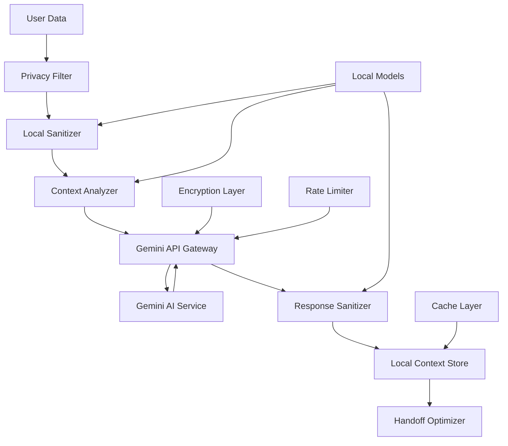

# Design Document: Privacy-First AI Integration

## Overview

The Privacy-First AI Integration system leverages Google's Gemini API for intelligent context analysis while maintaining strict privacy controls. The design implements a hybrid approach: local processing for sensitive operations and selective cloud processing for complex analysis, with comprehensive data sanitization ensuring no sensitive information leaves the device.

## Architecture

The AI system follows a layered privacy-first architecture:



## Components and Interfaces

### Core AI System

```kotlin
interface AISystem {
    suspend fun initializeModels(): Boolean
    suspend fun analyzeContext(data: UserData): ContextAnalysis
    suspend fun sanitizeData(data: Any): SanitizedData
    suspend fun generateSummary(content: String): ContentSummary
    suspend fun optimizeHandoff(context: HandoffContext): HandoffPlan
    fun getPrivacyReport(): PrivacyReport
}
```

### Gemini API Integration

```kotlin
interface GeminiAPIClient {
    suspend fun analyzeContent(
        sanitizedContent: String,
        analysisType: AnalysisType,
        privacyLevel: PrivacyLevel
    ): GeminiResponse
    
    suspend fun generateSummary(
        content: String,
        summaryType: SummaryType,
        maxLength: Int
    ): String
    
    suspend fun extractEntities(
        text: String,
        entityTypes: Set<EntityType>
    ): List<Entity>
    
    suspend fun classifyContent(
        content: String,
        categories: List<String>
    ): ContentClassification
}
```

### Privacy-First Data Sanitizer

```kotlin
interface DataSanitizer {
    suspend fun sanitizeText(text: String): SanitizedText
    suspend fun sanitizeCode(code: String, language: String): SanitizedCode
    suspend fun sanitizeStructuredData(data: Map<String, Any>): SanitizedData
    suspend fun detectSensitiveInfo(content: String): List<SensitiveInfo>
    fun getConfidenceScore(): Float
}
```

### Context Analyzer

```kotlin
interface ContextAnalyzer {
    suspend fun buildContextGraph(activities: List<UserActivity>): ContextGraph
    suspend fun analyzeCurrentContext(): CurrentContext
    suspend fun predictNextActions(context: CurrentContext): List<PredictedAction>
    suspend fun updateContextGraph(newActivity: UserActivity)
    suspend fun getRelevantContext(query: String): List<ContextItem>
}
```

### Local AI Models

```kotlin
interface LocalAIModel {
    suspend fun loadModel(modelPath: String): Boolean
    suspend fun processLocally(input: String): LocalProcessingResult
    suspend fun isModelAvailable(): Boolean
    fun getModelCapabilities(): Set<AICapability>
    suspend fun unloadModel()
}
```

## Data Models

### AI Processing Data Structures

```kotlin
@Serializable
data class UserData(
    val content: String,
    val contentType: ContentType,
    val timestamp: Long,
    val source: String,
    val metadata: Map<String, String> = emptyMap()
)

@Serializable
data class SanitizedData(
    val sanitizedContent: String,
    val originalHash: String,
    val sanitizationReport: SanitizationReport,
    val confidenceScore: Float,
    val privacyLevel: PrivacyLevel
)

@Serializable
data class ContextAnalysis(
    val mainTopics: List<String>,
    val entities: List<Entity>,
    val relationships: List<Relationship>,
    val sentiment: Sentiment,
    val importance: Float,
    val contextGraph: ContextGraph
)

@Serializable
data class ContentSummary(
    val summary: String,
    val keyPoints: List<String>,
    val entities: List<Entity>,
    val confidence: Float,
    val originalLength: Int,
    val summaryLength: Int
)

@Serializable
data class HandoffPlan(
    val prioritizedData: List<PrioritizedItem>,
    val estimatedSize: Long,
    val transferTime: Long,
    val reasoning: String,
    val alternatives: List<AlternativePlan>
)

data class ContextGraph(
    val nodes: List<ContextNode>,
    val edges: List<ContextEdge>,
    val clusters: List<ContextCluster>,
    val temporalSequence: List<TemporalEvent>
)

enum class ContentType {
    TEXT, CODE, DOCUMENT, EMAIL, CHAT, STRUCTURED_DATA, MEDIA_METADATA
}

enum class PrivacyLevel {
    PUBLIC, INTERNAL, CONFIDENTIAL, RESTRICTED
}

enum class AnalysisType {
    CONTEXT_EXTRACTION, ENTITY_RECOGNITION, SENTIMENT_ANALYSIS, 
    TOPIC_MODELING, RELATIONSHIP_MAPPING, INTENT_DETECTION
}
```

### Gemini API Integration

```kotlin
@Serializable
data class GeminiRequest(
    val content: String,
    val analysisType: AnalysisType,
    val parameters: Map<String, Any> = emptyMap(),
    val privacyLevel: PrivacyLevel,
    val requestId: String
)

@Serializable
data class GeminiResponse(
    val analysis: Map<String, Any>,
    val confidence: Float,
    val processingTime: Long,
    val tokensUsed: Int,
    val requestId: String
)

data class GeminiAPIConfig(
    val apiKey: String,
    val endpoint: String = "https://generativelanguage.googleapis.com/v1beta",
    val model: String = "gemini-pro",
    val maxTokens: Int = 8192,
    val temperature: Float = 0.1f,
    val rateLimitPerMinute: Int = 60
)
```

## Privacy-First Processing Pipeline

### Data Sanitization Pipeline

```kotlin
class PrivacyFirstSanitizer : DataSanitizer {
    
    private val localPIIDetector = LocalPIIDetector()
    private val anonymizer = DataAnonymizer()
    private val confidenceCalculator = ConfidenceCalculator()
    
    override suspend fun sanitizeText(text: String): SanitizedText {
        // Step 1: Local PII detection
        val sensitiveInfo = localPIIDetector.detectPII(text)
        
        // Step 2: Anonymization
        val anonymizedText = anonymizer.anonymize(text, sensitiveInfo)
        
        // Step 3: Confidence scoring
        val confidence = confidenceCalculator.calculateConfidence(
            original = text,
            sanitized = anonymizedText,
            detectedPII = sensitiveInfo
        )
        
        return SanitizedText(
            content = anonymizedText,
            originalHash = text.hashCode().toString(),
            removedItems = sensitiveInfo.map { it.type },
            confidence = confidence
        )
    }
}
```

### Gemini API Client Implementation

```kotlin
class OmnisyncraGeminiClient(
    private val config: GeminiAPIConfig,
    private val httpClient: HttpClient,
    private val rateLimiter: RateLimiter
) : GeminiAPIClient {
    
    override suspend fun analyzeContent(
        sanitizedContent: String,
        analysisType: AnalysisType,
        privacyLevel: PrivacyLevel
    ): GeminiResponse {
        // Rate limiting
        rateLimiter.acquire()
        
        // Build request
        val request = buildGeminiRequest(sanitizedContent, analysisType, privacyLevel)
        
        // Make API call with retry logic
        return withRetry(maxAttempts = 3) {
            val response = httpClient.post("${config.endpoint}/models/${config.model}:generateContent") {
                contentType(ContentType.Application.Json)
                setBody(request)
                header("Authorization", "Bearer ${config.apiKey}")
            }
            
            response.body<GeminiResponse>()
        }
    }
    
    private fun buildGeminiRequest(
        content: String,
        analysisType: AnalysisType,
        privacyLevel: PrivacyLevel
    ): GeminiAPIRequest {
        val prompt = buildPrompt(content, analysisType, privacyLevel)
        
        return GeminiAPIRequest(
            contents = listOf(
                Content(
                    parts = listOf(TextPart(text = prompt))
                )
            ),
            generationConfig = GenerationConfig(
                temperature = config.temperature,
                maxOutputTokens = config.maxTokens,
                topP = 0.8f,
                topK = 40
            ),
            safetySettings = buildSafetySettings(privacyLevel)
        )
    }
    
    private fun buildPrompt(
        content: String,
        analysisType: AnalysisType,
        privacyLevel: PrivacyLevel
    ): String {
        return when (analysisType) {
            AnalysisType.CONTEXT_EXTRACTION -> """
                Analyze the following content and extract key context information.
                Focus on: main topics, important entities, relationships, and semantic meaning.
                Privacy Level: $privacyLevel
                
                Content: $content
                
                Provide response in JSON format with: topics, entities, relationships, importance_score
            """.trimIndent()
            
            AnalysisType.ENTITY_RECOGNITION -> """
                Extract and classify entities from the following content.
                Include: people, organizations, locations, dates, technologies, concepts.
                Privacy Level: $privacyLevel
                
                Content: $content
                
                Provide response in JSON format with entity arrays by type.
            """.trimIndent()
            
            AnalysisType.TOPIC_MODELING -> """
                Identify main topics and themes in the following content.
                Provide topic hierarchy and relevance scores.
                Privacy Level: $privacyLevel
                
                Content: $content
                
                Provide response in JSON format with topics and confidence scores.
            """.trimIndent()
            
            else -> "Analyze the following content: $content"
        }
    }
}
```

## Correctness Properties

*A property is a characteristic or behavior that should hold true across all valid executions of a system-essentially, a formal statement about what the system should do. Properties serve as the bridge between human-readable specifications and machine-verifiable correctness guarantees.*

Now I need to analyze the acceptance criteria to create the correctness properties:

<function_calls>
<invoke name="prework">
<parameter name="featureName">phase-11-ai-integration

### Privacy and Data Sanitization Properties

**Property 1: PII Detection Coverage**
*For any* data being prepared for sharing, the Data_Sanitizer should scan for personally identifiable information
**Validates: Requirements 1.1**

**Property 2: PII Sanitization Completeness**
*For any* detected PII, the Data_Sanitizer should remove or anonymize it before transmission
**Validates: Requirements 1.2**

**Property 3: Semantic Preservation During Sanitization**
*For any* text content sanitization, semantic meaning should be preserved while sensitive details are removed
**Validates: Requirements 1.3**

**Property 4: Local-Only Sanitization**
*For any* sanitization operation, the Data_Sanitizer should operate entirely on-device without network connectivity
**Validates: Requirements 1.4**

**Property 5: Sanitization Confidence Scoring**
*For any* completed sanitization, the AI_System should provide a confidence score for the sanitization quality
**Validates: Requirements 1.5**

### Context Analysis Properties

**Property 6: Continuous Context Graph Building**
*For any* user activity, the Context_Analyzer should continuously build a context graph of relationships
**Validates: Requirements 2.1**

**Property 7: Relevant Information Identification**
*For any* context summary generation, the AI_System should identify the most relevant information for the current task
**Validates: Requirements 2.2**

**Property 8: Real-Time Context Updates**
*For any* significant context change, the Context_Analyzer should update the context graph in real-time
**Validates: Requirements 2.3**

**Property 9: Temporal Relationship Understanding**
*For any* temporal data, the Context_Analyzer should understand relationships between different activities and documents
**Validates: Requirements 2.4**

**Property 10: Multi-Context Prioritization**
*For any* multiple existing contexts, the AI_System should prioritize based on recency and relevance
**Validates: Requirements 2.5**

### Semantic Analysis Properties

**Property 11: Document Analysis Completeness**
*For any* document analysis, the Semantic_Engine should extract key topics, entities, and relationships
**Validates: Requirements 3.1**

**Property 12: Code Understanding Capability**
*For any* code file processing, the Semantic_Engine should understand programming concepts and dependencies
**Validates: Requirements 3.2**

**Property 13: Communication Intent Detection**
*For any* communication analysis, the Semantic_Engine should identify intent and important information
**Validates: Requirements 3.3**

**Property 14: Multi-Content Type Support**
*For any* supported content type, the Semantic_Engine should provide analysis including text, code, and structured data
**Validates: Requirements 3.4**

**Property 15: Structured Metadata Generation**
*For any* completed semantic analysis, the AI_System should generate structured metadata for intelligent indexing
**Validates: Requirements 3.5**

### Resource Summarization Properties

**Property 16: Information-Preserving Summarization**
*For any* document summarization, the Resource_Summarizer should create concise summaries preserving key information
**Validates: Requirements 4.1**

**Property 17: Privacy-Protected Summaries**
*For any* summary generation, the Privacy_Filter should ensure no sensitive information is included
**Validates: Requirements 4.2**

**Property 18: Code Summarization Focus**
*For any* code summarization, the AI_System should focus on functionality and architecture rather than specific implementations
**Validates: Requirements 4.3**

**Property 19: Adaptive Summary Generation**
*For any* content type and user preferences, the Resource_Summarizer should adapt summary length and detail accordingly
**Validates: Requirements 4.4**

**Property 20: Original Content Linking**
*For any* generated summary, the AI_System should maintain links to original content for detailed access
**Validates: Requirements 4.5**

### Handoff Optimization Properties

**Property 21: Context-Based Data Analysis**
*For any* handoff initiation, the Handoff_Optimizer should analyze current context to determine relevant data
**Validates: Requirements 5.1**

**Property 22: Pattern-Based Prioritization**
*For any* data selection for handoff, the AI_System should prioritize based on user behavior patterns and current task
**Validates: Requirements 5.2**

**Property 23: Bandwidth-Aware Optimization**
*For any* limited bandwidth scenario, the Handoff_Optimizer should compress and prioritize the most critical information
**Validates: Requirements 5.3**

**Property 24: Feedback-Based Learning**
*For any* user feedback, the Handoff_Optimizer should learn to improve future handoff decisions
**Validates: Requirements 5.4**

**Property 25: Decision Explanation Provision**
*For any* completed handoff optimization, the AI_System should provide explanations for its choices
**Validates: Requirements 5.5**

### Cross-Platform Consistency Properties

**Property 26: Platform Functionality Consistency**
*For any* platform (JVM, Android, JS, WASM), the AI_System should provide identical core functionality
**Validates: Requirements 6.1**

**Property 27: Transparent Acceleration Utilization**
*For any* available platform-specific AI acceleration, the AI_System should utilize it transparently
**Validates: Requirements 6.2**

**Property 28: Graceful Model Degradation**
*For any* unavailable AI models on a platform, the AI_System should gracefully degrade with simpler heuristics
**Validates: Requirements 6.3**

**Property 29: Efficient Resource Management**
*For any* resource-constrained device, the AI_System should manage model loading and memory usage efficiently
**Validates: Requirements 6.4**

**Property 30: Version Compatibility Management**
*For any* model updates, the AI_System should handle versioning and compatibility across platforms
**Validates: Requirements 6.5**

### Real-Time Context Awareness Properties

**Property 31: Rapid Context Updates**
*For any* user activity change, the Context_Analyzer should update context understanding within 500ms
**Validates: Requirements 7.1**

**Property 32: Multi-Application Relationship Understanding**
*For any* multiple active applications, the AI_System should understand the relationships between different tasks
**Validates: Requirements 7.2**

**Property 33: Historical Context Preservation**
*For any* context switch, the AI_System should maintain historical context for intelligent suggestions
**Validates: Requirements 7.3**

**Property 34: Behavioral Pattern Detection**
*For any* user behavior over time, the Context_Analyzer should detect patterns to predict future needs
**Validates: Requirements 7.4**

**Property 35: Local Privacy Maintenance**
*For any* active context analysis, the AI_System should maintain privacy by processing all data locally
**Validates: Requirements 7.5**

### Adaptive Learning Properties

**Property 36: Privacy-Preserving Learning**
*For any* user interaction, the AI_System should learn preferences without storing personal data
**Validates: Requirements 8.1**

**Property 37: Feedback-Based Adaptation**
*For any* suggestion made, the AI_System should adapt based on user acceptance or rejection of previous suggestions
**Validates: Requirements 8.2**

**Property 38: Pattern-Based Improvement**
*For any* detected patterns, the AI_System should use them to improve context analysis and handoff optimization
**Validates: Requirements 8.3**

**Property 39: User Preference Control**
*For any* learned preferences, the AI_System should allow users to reset or modify them at any time
**Validates: Requirements 8.4**

**Property 40: Encrypted Local Learning**
*For any* learning operation, the AI_System should ensure all learning data remains on-device and encrypted
**Validates: Requirements 8.5**

### Performance Properties

**Property 41: Context Analysis Performance**
*For any* typical document size, the AI_System should complete context analysis within 200ms
**Validates: Requirements 9.1**

**Property 42: Large Dataset Streaming**
*For any* large dataset processing, the AI_System should use streaming and chunking to maintain responsiveness
**Validates: Requirements 9.2**

**Property 43: Resource-Aware Complexity Reduction**
*For any* limited system resources, the AI_System should automatically reduce processing complexity
**Validates: Requirements 9.3**

**Property 44: Performance-Optimized Caching**
*For any* frequently accessed analysis results, the AI_System should cache them to improve performance
**Validates: Requirements 9.4**

**Property 45: User Experience During Intensive Processing**
*For any* intensive AI processing, the AI_System should provide progress indicators and allow cancellation
**Validates: Requirements 9.5**

### Explainable AI Properties

**Property 46: Decision Explanation Provision**
*For any* AI suggestion or decision, the AI_System should provide clear explanations for its reasoning
**Validates: Requirements 10.1**

**Property 47: Source Attribution in Summaries**
*For any* generated context summary, the AI_System should show which sources contributed to the summary
**Validates: Requirements 10.2**

**Property 48: Sanitization Reporting**
*For any* data sanitization, the Privacy_Filter should report what types of information were removed or modified
**Validates: Requirements 10.3**

**Property 49: Decision Override and Learning**
*For any* AI decision, the AI_System should allow users to override it and learn from these corrections
**Validates: Requirements 10.4**

**Property 50: Clear Explanation Language**
*For any* provided explanation, the AI_System should use clear, non-technical language that users can understand
**Validates: Requirements 10.5**

## Error Handling

The AI system implements comprehensive error handling for both local processing and Gemini API integration:

### Local Processing Errors
- **Model Loading Failures**: Graceful degradation to simpler heuristics
- **Memory Constraints**: Automatic complexity reduction and streaming
- **Processing Timeouts**: Cancellation support and progress indication

### Gemini API Errors
- **Rate Limiting**: Exponential backoff and request queuing
- **Network Failures**: Retry logic with fallback to local processing
- **API Quota Exceeded**: Graceful degradation with user notification
- **Invalid Responses**: Response validation and error recovery

### Privacy Protection Errors
- **Sanitization Failures**: Conservative approach - block transmission
- **PII Detection Errors**: Err on the side of privacy protection
- **Confidence Score Issues**: Default to highest privacy level

## Testing Strategy

### Dual Testing Approach

**Unit Tests** focus on:
- Individual AI component functionality
- Gemini API integration and error handling
- Privacy filter effectiveness
- Local model performance
- Cross-platform compatibility

**Property-Based Tests** focus on:
- Privacy preservation across all operations
- Context analysis consistency and accuracy
- Performance characteristics under various loads
- Learning and adaptation behavior
- Cross-platform functionality equivalence

### AI-Specific Testing

**Privacy Testing**:
- PII detection accuracy across various data types
- Sanitization effectiveness and semantic preservation
- Local-only processing verification
- Data leakage prevention

**Intelligence Testing**:
- Context analysis accuracy and relevance
- Summary quality and information preservation
- Handoff optimization effectiveness
- Learning and adaptation measurement

**Performance Testing**:
- Response time measurement under various loads
- Memory usage optimization verification
- Gemini API rate limiting and quota management
- Cross-platform performance consistency

### Property-Based Testing Configuration

- **Testing Framework**: Kotest Property Testing with AI-specific generators
- **Minimum Iterations**: 100 per property test
- **AI Model Testing**: Mock models for consistent testing
- **Privacy Verification**: Automated PII detection in test outputs

Each property test must be tagged with:
**Feature: phase-11-ai-integration, Property {number}: {property_text}**