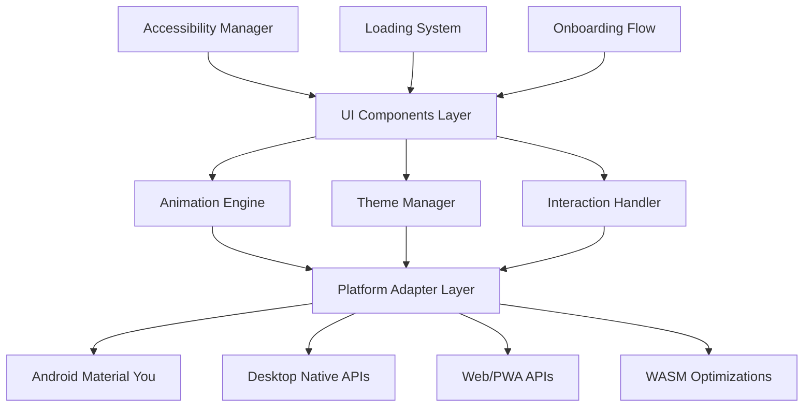

# Design Document: UI/UX Excellence

## Overview

The UI/UX Excellence system transforms Omnisyncra into a polished, professional application that showcases advanced distributed computing through stunning visual design and seamless user interactions. This design focuses on creating platform-native experiences while maintaining cross-platform consistency and accessibility.

## Architecture

The UI/UX system follows a layered architecture with platform-specific adapters:



## Components and Interfaces

### Core UI Components

**LoadingStateManager**
```kotlin
interface LoadingStateManager {
    suspend fun showSkeletonScreen(layout: SkeletonLayout)
    suspend fun showShimmerEffect(elements: List<UIElement>)
    suspend fun showProgressIndicator(progress: Float, estimatedTime: Duration?)
    suspend fun transitionToContent(content: @Composable () -> Unit)
}
```

**AnimationEngine**
```kotlin
interface AnimationEngine {
    fun createShimmerAnimation(): InfiniteTransition
    fun createFadeTransition(duration: Duration): Transition
    fun createElasticPullRefresh(): PullRefreshState
    fun maintainFrameRate(targetFps: Int = 60): FrameRateController
}
```

**ThemeManager**
```kotlin
interface ThemeManager {
    fun applyDynamicColors(source: ColorSource): ColorScheme
    fun handleThemeChange(newTheme: ThemeData)
    fun ensureAccessibilityContrast(colors: ColorScheme): ColorScheme
    fun getPlatformSpecificTheme(): PlatformTheme
}
```

### Platform Adapters

**AndroidPlatformAdapter**
```kotlin
class AndroidPlatformAdapter : PlatformAdapter {
    fun extractMaterialYouColors(): ColorScheme
    fun handleSystemThemeChange()
    fun integrateWithSystemNotifications()
}
```

**DesktopPlatformAdapter**
```kotlin
class DesktopPlatformAdapter : PlatformAdapter {
    fun provideNativeWindowControls()
    fun handleKeyboardShortcuts()
    fun manageWindowResize()
}
```

**WebPlatformAdapter**
```kotlin
class WebPlatformAdapter : PlatformAdapter {
    fun enablePWAFeatures()
    fun handleOfflineStates()
    fun leverageWebAPIs()
}
```

## Data Models

### Loading States
```kotlin
sealed class LoadingState {
    object Idle : LoadingState()
    data class Loading(val progress: Float? = null) : LoadingState()
    data class Skeleton(val layout: SkeletonLayout) : LoadingState()
    data class Error(val message: String, val retry: () -> Unit) : LoadingState()
    object Success : LoadingState()
}
```

### Animation Configurations
```kotlin
data class AnimationConfig(
    val duration: Duration = 300.milliseconds,
    val easing: Easing = FastOutSlowInEasing,
    val targetFps: Int = 60,
    val enableReducedMotion: Boolean = false
)
```

### Theme Data
```kotlin
data class ThemeData(
    val colorScheme: ColorScheme,
    val typography: Typography,
    val shapes: Shapes,
    val platformSpecific: PlatformThemeData
)
```

## Correctness Properties

*A property is a characteristic or behavior that should hold true across all valid executions of a system-essentially, a formal statement about what the system should do. Properties serve as the bridge between human-readable specifications and machine-verifiable correctness guarantees.*

### Loading State Properties

**Property 1: Loading Indicator Responsiveness**
*For any* data loading operation, when it begins, loading indicators should appear within 100ms
**Validates: Requirements 1.1**

**Property 2: Skeleton Screen Timing**
*For any* loading operation exceeding 2 seconds, skeleton screens matching the expected content layout should be displayed
**Validates: Requirements 1.2**

**Property 3: Progress Indicator Activation**
*For any* loading operation exceeding 5 seconds, progress percentages and estimated completion times should be displayed
**Validates: Requirements 1.3**

**Property 4: Loading Completion Transitions**
*For any* completed loading operation, the system should smoothly transition from loading states to content with fade-in animations
**Validates: Requirements 1.4**

**Property 5: Loading Error Handling**
*For any* failed loading operation, clear error messages with retry options should be displayed
**Validates: Requirements 1.5**

### Shimmer and Animation Properties

**Property 6: Skeleton Shimmer Animation**
*For any* displayed skeleton screen, shimmer effects should animate across all placeholder elements
**Validates: Requirements 2.1**

**Property 7: Progressive Content Replacement**
*For any* progressively loading content, skeleton elements should be replaced with actual content using smooth transitions
**Validates: Requirements 2.2**

**Property 8: Shimmer Performance Consistency**
*For any* running shimmer animation, 60fps performance should be maintained across all platforms
**Validates: Requirements 2.3**

**Property 9: Skeleton Layout Accuracy**
*For any* skeleton screen display, the layout dimensions should exactly match the final content dimensions
**Validates: Requirements 2.4**

**Property 10: Multi-Element Shimmer Coordination**
*For any* display with multiple skeleton elements, shimmer timing should be coordinated for visual coherence
**Validates: Requirements 2.5**

### Tooltip and Help System Properties

**Property 11: Tooltip Response Timing**
*For any* interactive element hover or long-press, contextual tooltips should display within 500ms
**Validates: Requirements 3.1**

**Property 12: Tooltip Positioning Intelligence**
*For any* appearing tooltip, positioning should avoid screen edges and content occlusion
**Validates: Requirements 3.2**

**Property 13: Progressive Help Disclosure**
*For any* complex feature interaction, progressive disclosure of help information should be offered
**Validates: Requirements 3.3**

**Property 14: Rich Help Content Support**
*For any* displayed help content, rich formatting including text, images, and interactive elements should be supported
**Validates: Requirements 3.4**

**Property 15: Tooltip Preference Persistence**
*For any* dismissed tooltip, user preferences should be remembered to avoid repetitive displays
**Validates: Requirements 3.5**

### Gesture and Scroll Properties

**Property 16: Pull-to-Refresh Responsiveness**
*For any* pull-to-refresh gesture, immediate visual feedback with elastic animations should be provided
**Validates: Requirements 4.1**

**Property 17: Refresh Completion Behavior**
*For any* completed refresh operation, smooth return to normal state with success indicators should occur
**Validates: Requirements 4.2**

**Property 18: Boundary Preloading**
*For any* scroll near content boundaries, additional content should be preloaded seamlessly
**Validates: Requirements 4.3**

**Property 19: Infinite Scroll State Management**
*For any* infinite scroll loading new content, scroll position should be maintained and subtle loading indicators provided
**Validates: Requirements 4.4**

**Property 20: Scroll Performance Consistency**
*For any* scroll operation, smooth 60fps performance should be maintained across all platforms
**Validates: Requirements 4.5**

### Onboarding Properties

**Property 21: New Feature Introduction**
*For any* encounter with new features, contextual introduction overlays should be provided by the onboarding flow
**Validates: Requirements 5.2**

**Property 22: Onboarding State Tracking**
*For any* onboarding progression, completion state should be tracked and users should be allowed to skip or replay sections
**Validates: Requirements 5.3**

**Property 23: Onboarding Completion Transition**
*For any* completed onboarding, smooth transition to the main application experience should occur
**Validates: Requirements 5.5**

### Android Material You Properties

**Property 24: Dynamic Color Extraction**
*For any* Android 12+ device, dynamic colors should be extracted and applied from the system wallpaper
**Validates: Requirements 6.1**

**Property 25: Theme Change Responsiveness**
*For any* system theme change, application colors should update within 200ms
**Validates: Requirements 6.2**

**Property 26: Accessibility Contrast Maintenance**
*For any* applied dynamic theming, proper contrast ratios for accessibility should be maintained
**Validates: Requirements 6.3**

**Property 27: Material You Fallback**
*For any* unavailable Material You colors, graceful fallback to default Material 3 colors should occur
**Validates: Requirements 6.4**

**Property 28: Color Scheme Transition Smoothness**
*For any* color scheme update, smooth transitions between color palettes should be animated
**Validates: Requirements 6.5**

### Desktop Platform Properties

**Property 29: Native Window Controls**
*For any* desktop platform execution, native window controls (minimize, maximize, close) should be provided
**Validates: Requirements 7.1**

**Property 30: Keyboard Shortcut Support**
*For any* menu interaction, standard keyboard shortcuts (Ctrl+C, Ctrl+V, etc.) should be supported
**Validates: Requirements 7.2**

**Property 31: Focus and Navigation Handling**
*For any* application focus gain, system-level keyboard navigation should be properly handled
**Validates: Requirements 7.3**

**Property 32: Responsive Window Resizing**
*For any* window resize operation, responsive layouts and component proportions should be maintained
**Validates: Requirements 7.4**

**Property 33: Native Notification Integration**
*For any* desktop notification need, native system notification APIs should be used
**Validates: Requirements 7.5**

### Web/PWA Properties

**Property 34: PWA Installation Prompts**
*For any* web application visit, installation prompts for PWA capabilities should be provided
**Validates: Requirements 8.1**

**Property 35: Installed PWA Experience**
*For any* installed application, native-like navigation and full-screen experience should be provided
**Validates: Requirements 8.2**

**Property 36: Offline State Handling**
*For any* network connectivity loss, graceful offline state handling with appropriate messaging should occur
**Validates: Requirements 8.3**

**Property 37: Web API Utilization**
*For any* web feature interaction, Web APIs should be leveraged for enhanced functionality
**Validates: Requirements 8.4**

**Property 38: PWA Update Management**
*For any* available PWA update, users should be notified and seamless updates should be handled
**Validates: Requirements 8.5**

### WASM Performance Properties

**Property 39: WASM Performance Utilization**
*For any* complex computation execution, WASM should be leveraged for performance-critical operations
**Validates: Requirements 9.1**

**Property 40: WASM Animation Performance**
*For any* UI animation execution, 60fps performance should be maintained using optimized WASM modules
**Validates: Requirements 9.2**

**Property 41: WASM Memory Management**
*For any* memory-intensive operation, WASM memory allocation should be efficiently managed
**Validates: Requirements 9.3**

**Property 42: WASM Loading State Management**
*For any* WASM module loading, appropriate loading states and fallback mechanisms should be provided
**Validates: Requirements 9.4**

**Property 43: Automatic Performance Optimization**
*For any* detected performance bottleneck, resource allocation should be automatically optimized
**Validates: Requirements 9.5**

### Accessibility Properties

**Property 44: Screen Reader Semantic Support**
*For any* screen reader navigation, comprehensive semantic markup and descriptions should be provided
**Validates: Requirements 10.1**

**Property 45: High Contrast Mode Support**
*For any* high contrast requirement, platform-specific high contrast modes should be supported
**Validates: Requirements 10.2**

**Property 46: Keyboard-Only Navigation**
*For any* keyboard-only interaction, clear focus indicators and logical tab ordering should be provided
**Validates: Requirements 10.3**

**Property 47: Text Scaling Layout Integrity**
*For any* larger text requirement, appropriate scaling should occur while maintaining layout integrity
**Validates: Requirements 10.4**

**Property 48: Accessibility Feature Compatibility**
*For any* enabled accessibility feature, full functionality should be maintained without degradation
**Validates: Requirements 10.5**

## Error Handling

The UI/UX system implements comprehensive error handling:

- **Graceful Degradation**: When advanced features fail, the system falls back to basic functionality
- **User-Friendly Messages**: All errors are presented with clear, actionable messages
- **Retry Mechanisms**: Failed operations provide retry options with exponential backoff
- **Platform Fallbacks**: When platform-specific features are unavailable, cross-platform alternatives are used
- **Performance Monitoring**: Automatic detection and response to performance issues

## Testing Strategy

### Dual Testing Approach

The UI/UX system requires both unit tests and property-based tests for comprehensive coverage:

**Unit Tests** focus on:
- Specific animation timing and easing functions
- Platform-specific integration points
- Error conditions and edge cases
- Accessibility compliance verification
- Performance benchmarks for critical operations

**Property-Based Tests** focus on:
- Universal UI behaviors across all platforms
- Animation performance consistency (60fps requirement)
- Loading state transitions and timing
- Theme and color scheme handling
- Gesture recognition and response timing

### Property-Based Testing Configuration

- **Testing Framework**: Kotest Property Testing for Kotlin Multiplatform
- **Minimum Iterations**: 100 per property test
- **Performance Tests**: Dedicated performance property tests with frame rate monitoring
- **Cross-Platform Coverage**: All properties tested on JVM, Android, JS, and WASM targets

Each property test must be tagged with:
**Feature: ui-ux-excellence, Property {number}: {property_text}**

### Testing Priorities

1. **Performance Properties**: Frame rate consistency, loading timing, animation smoothness
2. **Cross-Platform Properties**: Consistent behavior across all supported platforms
3. **Accessibility Properties**: WCAG compliance and platform accessibility standards
4. **Platform-Specific Properties**: Material You, desktop integration, PWA features
5. **User Experience Properties**: Gesture responsiveness, visual feedback, error handling